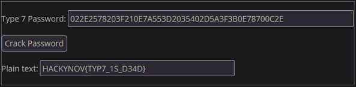

<div align="center">
  <a href="https://hackynov.fr"></a>
  <br><br>
  
  
  
  
  
  <p>Follow us on</p>
  <a href="https://www.linkedin.com/company/hacky-nov/">Linkedin</a>
  •
  <a href="https://twitter.com/HackyNov">Twitter</a>
  •
  <a href="https://discord.gg/JGue7PhV">Discord</a>
  •
  <a href="https://www.twitch.tv/hackynov">Twitch</a>
  •
  <a href="">Youtube (coming soon)</a>
</div>

----
## Contact me

Pseudo : Cursecure<br/>
Pro : [Ludovic Mullot](https://www.linkedin.com/in/ludovic-mullot/)

## Write-up

Based on the context, someone connected to the Elderberry company switch deleted their configuration to create a DDoS. We may assume that we should turn to the part about the remote connections of the switch.

Section line VTY 0 4 and line VTY 5 15 from the Elderby switch configuration file should do the trick.

```texte
line vty 0 4
 login local
 transport input ssh
 transport output ssh
line vty 5 15
 login local
 transport input ssh
 transport output ssh
```

Generally, the SSH connection allows users set up on the switch to connect to it. 
So we’re looking at the user portion.

```texte
username jdaniele password 7 09464A061C480713181F13253920
username rrobert password 7 095E5D0410111F5F1B0D17393C2B3A37 
username user privilege password 7 022E2578203F210E7A553D2035402D5A3F3B0E78700C2E
username admin privilege secret 5 $1$mERr$IZDWWEpMCscy1sTS45Bs01
```

After an internet search, it appears that cisco type 7 encryption is broken. In other words, it is reversible.
With https://www.ifm.net.nz/cookbooks/passwordcracker.html we can quickly break the password and get the flag of the event.



Flag : HACKYNOV[TYP7_1S_D34D}
